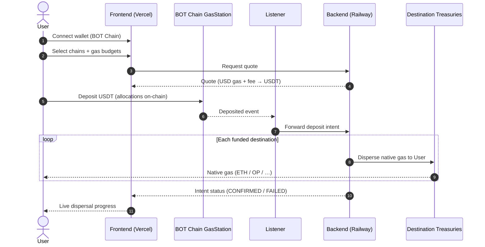
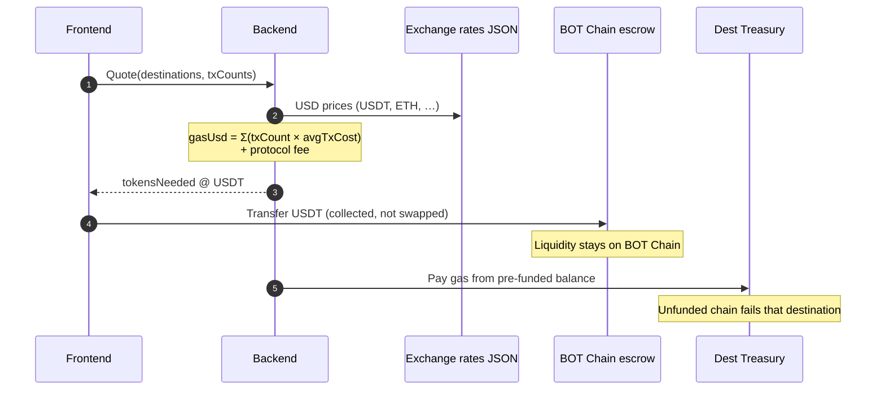
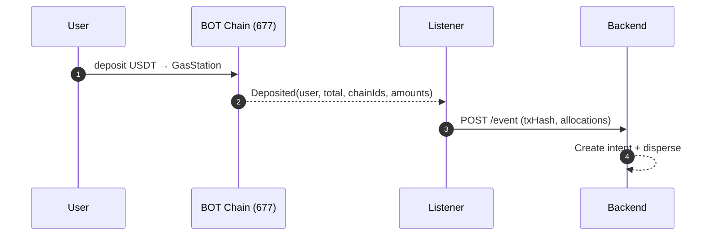

# Gas Provider

**Settled on [BOT Chain](https://scan.botchain.ai)** — the source chain for every deposit.

> Pay once in **USDT** on BOT Chain and receive **native gas** on the destination chains you choose — no bridging, no DEX hop, no faucet hunt.

**Live demo:** [https://gas-provider.vercel.app](https://gas-provider.vercel.app)  
**Live API:** [https://backend-production-6f62.up.railway.app](https://backend-production-6f62.up.railway.app) (`/health`)  
**Explorer:** [scan.botchain.ai](https://scan.botchain.ai) · **RPC:** `https://rpc.botchain.ai`

---

## Why BOT Chain

BOT Chain is the settlement layer. Users connect a wallet to **BOT Chain mainnet (677)** (or testnet 968 for pre-deploy checks), deposit USDT into the **GasStation** escrow, and the rest of the stack fans native gas out to Base, Optimism, World, and other destinations.

| | BOT Chain |
|---|---|
| **Role** | Source chain — deposits + escrow live here |
| **Mainnet** | Chain ID **677** · [rpc.botchain.ai](https://rpc.botchain.ai) · [scan.botchain.ai](https://scan.botchain.ai) |
| **Testnet** | Chain ID **968** · [rpc.bohr.life](https://rpc.bohr.life) · [scan.bohr.life](https://scan.bohr.life) |
| **Native** | BOT |
| **Deposit asset** | USDT (6 decimals) |

---

## The problem

Every new chain needs its own native gas token. Getting it usually means bridging, DEX swaps, faucets, or asking someone to send a tiny amount of ETH/OP/MATIC — repeated for every network. Builders end up with stables on one chain while wallets sit empty of the one asset that unlocks the next transaction.

## The solution

**Gas Provider** turns a single BOT Chain deposit into usable gas everywhere:

1. Connect a wallet on **BOT Chain**
2. Select destination chains and how much gas you need
3. Pay with **USDT** into the GasStation escrow on BOT Chain
4. The listener indexes the on-chain `Deposited` event
5. Pre-funded destination treasuries send native gas to your wallet

---

## Sequence diagrams

### End-to-end: USDT on BOT Chain → multi-chain gas



### Quote + treasury accounting (no DEX, no bridge)



### Deposit indexing on BOT Chain



---

## Competitive landscape

| | Pay with USDT on BOT Chain | Native gas on many chains | On-chain split | No bridge risk |
|---|---|---|---|---|
| **Gas Provider** | 🟢 | 🟢 | 🟢 | 🟢 |
| **Bridges** | 🔴 | 🟡 | 🔴 | 🔴 |
| **Faucets** | 🔴 | 🔴 | 🔴 | 🟢 |
| **Wallet airdrops** | 🔴 | 🟡 | 🔴 | 🟢 |

---

## BOT Chain contracts

### Mainnet (chain ID 677)

| Contract | Address |
|----------|---------|
| **GasStation** (escrow) | [`0x418ccA81E0c19d2F49Eee4D34274b29cfF59C85c`](https://scan.botchain.ai/address/0x418ccA81E0c19d2F49Eee4D34274b29cfF59C85c) |
| **USDT** (deposit asset, 6 decimals) | `0xababc7ddc03e501d190c676bf3d92ef0e6e87a3c` |
| MockWETH | `0xA318dCFa9bb24c83357F5AB170c32dEd02C17De2` |
| MockSwapRouter | `0xfd025D625d93ed39C9a7a6F24E1eDCD1Ab8fBcb7` |

Deployer: `0x562d89c9709B5F51dDAcABafC8e0e7A074186428`

### Testnet (chain ID 968)

| Contract | Address |
|----------|---------|
| **GasStation** | [`0xE329210534a500Fa7AC6DA1C15Ae73132836E35d`](https://scan.bohr.life/address/0xE329210534a500Fa7AC6DA1C15Ae73132836E35d) |
| **USDT** | `0x75edC9335175Fc0552D51D48439F229c10420fe3` |

### Destination treasuries

Pre-funded treasuries on OP Sepolia, Base Sepolia, World Sepolia, and other testnets send native gas. Default demo treasury: `0x5b402676535a3ba75c851c14e1e249a4257d2265`.

Full list: [docs/TREASURY_ADDRESSES.md](docs/TREASURY_ADDRESSES.md) · BOT Chain deploy notes: [contracts/DEPLOYED_ADDRESSES.md](contracts/DEPLOYED_ADDRESSES.md)

---

## Repo layout

```
Gasprovider-B/
├── frontend/     # Vite + React (Vercel) — BOT Chain wallet + disperse UI
├── backend/      # Fastify + Prisma (Railway) — quotes + treasury payouts
├── contracts/    # GasStation on BOT Chain + destination treasuries
├── listener/     # Indexes Deposited events on BOT Chain
└── docs/         # Guides & addresses
```

---

## Quick start (local)

### Prerequisites

- Node.js 18+
- PostgreSQL (Docker optional)
- A wallet funded with **USDT on BOT Chain** (mainnet) or testnet USDT (968)

### Backend

```bash
cd backend
cp .env.example .env
# CONTRACT_ADDRESS_677=0x418ccA81E0c19d2F49Eee4D34274b29cfF59C85c
# BOTCHAIN_RPC_URL=https://rpc.botchain.ai
# DISTRIBUTOR_PRIVATE_KEY / DATABASE_URL
npm install
npx prisma migrate deploy
npm run dev            # http://localhost:3000
```

### Listener (BOT Chain deposits)

```bash
cd listener
cp env.example .env
# BOTCHAIN_RPC_URL=https://rpc.botchain.ai
# CONTRACT_ADDRESS_677=0x418ccA81E0c19d2F49Eee4D34274b29cfF59C85c
# BACKEND_URL=http://localhost:3000/event
npm install
npm start
```

### Frontend

```bash
cd frontend
cp .env.example .env.local
# VITE_API_URL=http://localhost:3000
# VITE_REOWN_PROJECT_ID=<your Reown/AppKit id>
# Optional: VITE_BOTCHAIN_NETWORK=testnet
npm install
npm run dev            # http://127.0.0.1:5173
```

### Demo flow

1. Connect wallet on **BOT Chain** (add network: chain ID 677, RPC `https://rpc.botchain.ai`)
2. Hold USDT on BOT Chain
3. Pick funded destination chains
4. Deposit USDT → watch native gas arrive

### Deploy / e2e on BOT Chain

```bash
cd contracts
BOTCHAIN_NETWORK=testnet PRIVATE_KEY=0x... node scripts/deploy-botchain.mjs
BOTCHAIN_NETWORK=testnet PRIVATE_KEY=0x... node scripts/e2e-botchain.mjs
```

`e2e-botchain.mjs` deposits a dust amount of USDT and asserts the `Deposited` event (9/9 on testnet).

---

## Production

| Service | URL / notes |
|---------|-------------|
| Frontend | [gas-provider.vercel.app](https://gas-provider.vercel.app) |
| Backend API | [backend-production-6f62.up.railway.app](https://backend-production-6f62.up.railway.app) |
| Source chain | **BOT Chain** mainnet (677) |
| Explorer | [scan.botchain.ai](https://scan.botchain.ai) |

### Frontend env (Vercel Production)

- `VITE_API_URL=https://backend-production-6f62.up.railway.app`
- `VITE_REOWN_PROJECT_ID` — Reown AppKit project id
- `VITE_BOTCHAIN_NETWORK=mainnet` (or `testnet`)
- `VITE_BOTCHAIN_CONTRACT_ADDRESS` — GasStation on BOT Chain (defaults to mainnet deploy)

### Backend / listener env

- `BOTCHAIN_RPC_URL=https://rpc.botchain.ai`
- `CONTRACT_ADDRESS_677` — GasStation escrow
- `DISTRIBUTOR_PRIVATE_KEY` — destination treasury operator
- `TREASURY_*_ADDRESS` — per-destination payout contracts

---

## Documentation

- [docs/README.md](docs/README.md) — index
- [docs/USER_GUIDE.md](docs/USER_GUIDE.md) — end-user guide
- [docs/DEPLOYMENT_GUIDE.md](docs/DEPLOYMENT_GUIDE.md) — deploy
- [docs/ENVIRONMENT_VARIABLES.md](docs/ENVIRONMENT_VARIABLES.md) — env reference
- [docs/TREASURY_ADDRESSES.md](docs/TREASURY_ADDRESSES.md) — destination treasuries
- [contracts/DEPLOYED_ADDRESSES.md](contracts/DEPLOYED_ADDRESSES.md) — BOT Chain GasStation + USDT

---

## Tech stack

- **Source chain:** BOT Chain (677 / 968)
- **Frontend:** Vite, React 19, wagmi, Reown AppKit, Tailwind
- **Backend:** Fastify, Prisma, PostgreSQL
- **Contracts:** Solidity — GasStation escrow on BOT Chain, Treasury on destinations
- **Indexer:** ethers listener on `Deposited` (HTTP poll or `BOTCHAIN_WS_URL`)

---

## License

See repository license file if present.
