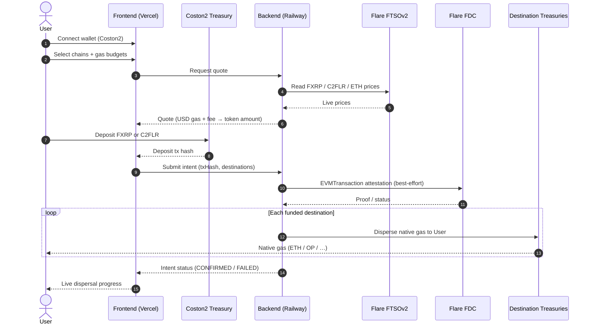
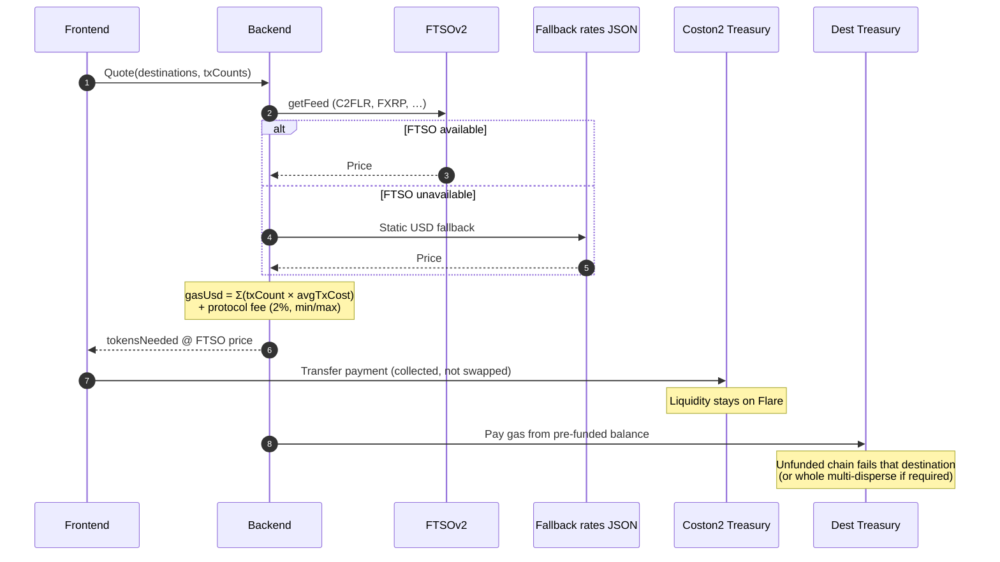
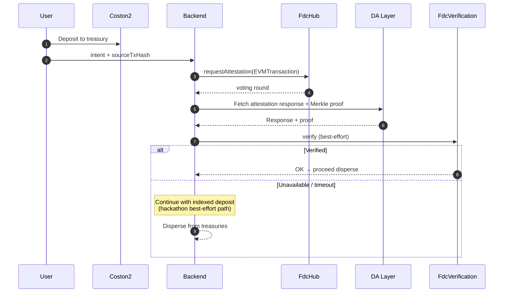

# Gas Provider

**Flare Summer Signal · Track 1 — Interoperable Asset Products**

> Pay once in **FXRP** or **C2FLR** on Flare (Coston2) and receive **native gas** on the destination chains you choose — without bridging, swapping, or hunting faucets.

**Live demo:** [https://gas-provider.vercel.app](https://gas-provider.vercel.app)  
**Live API:** [https://backend-production-6f62.up.railway.app](https://backend-production-6f62.up.railway.app) (`/health`)  
**Demo video:** [YouTube](https://youtu.be/XTCR6daMmE0)  
**Pitch deck:** [Google Slides](https://docs.google.com/presentation/d/1dcDHlryNzrDfVudiqPB-xnrNiIX9w971PFaoAP4Jztk/edit?usp=sharing)  

---

## The problem

Every new chain needs its own native gas token. Getting it usually means bridging, DEX swaps, faucets, or asking someone to send a tiny amount of ETH/OP/MATIC — repeated for every network. Builders and multi-chain users end up with FXRP, stables, or FAssets while wallets sit empty of the one asset that unlocks the next transaction.

## The solution

**Gas Provider** turns Flare interoperable assets into usable gas everywhere:

1. Select destination chains and how much gas you need  
2. Pay with **FXRP** or **C2FLR** on **Coston2**  
3. Quote uses live **FTSO** prices (+ protocol fee)  
4. Deposit lands in the Coston2 treasury (no DEX swap)  
5. **FDC** attestation verifies the deposit (best-effort)  
6. Pre-funded destination treasuries send native gas to your wallet  

---

## Sequence diagrams

### End-to-end: FXRP/C2FLR → multi-chain gas



### Quote + treasury accounting (no DEX swap)



### FDC deposit verification (best-effort)



---

## Competitive Landscape

| | Pay with FXRP on Flare | Native gas on many chains | Live FTSO pricing | FDC-verified deposit | No bridge risk |
|---|---|---|---|---|---|
| **Gas Provider** | 🟢 | 🟢 | 🟢 | 🟢 | 🟢 |
| **Bridges** | 🔴 | 🟡 | 🔴 | 🔴 | 🔴 |
| **Faucets** | 🔴 | 🔴 | 🔴 | 🔴 | 🟢 |
| **Wallet airdrops** | 🔴 | 🟡 | 🔴 | 🔴 | 🟢 |

## Flare stack (Track 1)

| Primitive | Role |
|-----------|------|
| **FAssets (FXRP)** | Pay with interoperable XRP on Flare |
| **FTSOv2** | Live FXRP / C2FLR / ETH pricing for quotes |
| **FDC** | EVMTransaction attestation of the deposit |
| **Coston2 treasuries** | Collect payment; destination treasuries pay out gas |

---

## Treasuries (testnet)

| Chain | Chain ID | Treasury |
|-------|----------|----------|
| **Coston2 (source)** | 114 | `0xc031c437d6b915dbdc946dbd8613a1ac9dd75d63` |
| Destination testnets (OP, Base, Arb, World, …) | various | `0x5b402676535a3ba75c851c14e1e249a4257d2265` |

Operator / deployer: `0x56b9768F769b88c861955ca2eA3EC1f91870d61c`

Full list: [docs/TREASURY_ADDRESSES.md](docs/TREASURY_ADDRESSES.md)

---

## Repo layout

```
GasProvider-main 2/
├── frontend/     # Vite + React (Vercel)
├── backend/      # Fastify + Prisma (Railway)
├── contracts/    # Treasury / escrow (Hardhat)
├── listener/     # Deposit event indexer
└── docs/         # Guides & addresses
```

---

## Quick start (local)

### Prerequisites

- Node.js 18+
- PostgreSQL (Docker optional)

### Backend

```bash
cd backend
cp .env.example .env   # set DISTRIBUTOR_PRIVATE_KEY / DATABASE_URL
npm install
npx prisma migrate deploy
npm run dev            # http://localhost:3000
```

### Frontend

```bash
cd frontend
cp .env.example .env.local  # or create with:
# VITE_API_URL=http://localhost:3000
# VITE_REOWN_PROJECT_ID=<your Reown/AppKit id>
npm install
npm run dev            # http://127.0.0.1:5173
```

### Demo flow

1. Connect wallet on **Coston2**  
2. Get C2FLR / mint FXRP (faucets / FAssets wizard)  
3. Pick funded destination chains  
4. Deposit FXRP or C2FLR → watch gas arrive  

---

## Production

| Service | URL / notes |
|---------|-------------|
| Frontend | [gas-provider.vercel.app](https://gas-provider.vercel.app) |
| Backend API | [backend-production-6f62.up.railway.app](https://backend-production-6f62.up.railway.app) |
| Demo video | [YouTube](https://youtu.be/XTCR6daMmE0) |
| Pitch deck | [Google Slides](https://docs.google.com/presentation/d/1dcDHlryNzrDfVudiqPB-xnrNiIX9w971PFaoAP4Jztk/edit?usp=sharing) |
| Source chain | Flare **Coston2** (114) |

### Frontend env (Vercel Production)

- `VITE_API_URL=https://backend-production-6f62.up.railway.app`  
- `VITE_REOWN_PROJECT_ID` — Reown AppKit project id  
- `VITE_TREASURY_*_ADDRESS` — treasury contracts per chain  

---

## Documentation

- [docs/README.md](docs/README.md) — index  
- [docs/USER_GUIDE.md](docs/USER_GUIDE.md) — end-user guide  
- [docs/DEPLOYMENT_GUIDE.md](docs/DEPLOYMENT_GUIDE.md) — deploy  
- [docs/ENVIRONMENT_VARIABLES.md](docs/ENVIRONMENT_VARIABLES.md) — env reference  
- [docs/TREASURY_ADDRESSES.md](docs/TREASURY_ADDRESSES.md) — contracts  
- [docs/FLARE_INTEGRATION_FILES.md](docs/FLARE_INTEGRATION_FILES.md) — FTSO / FDC / FAssets map  

---

## Tech stack

- **Frontend:** Vite, React 19, wagmi, Reown AppKit, Tailwind  
- **Backend:** Fastify, Prisma, PostgreSQL  
- **Contracts:** Solidity / Hardhat  
- **Oracles & data:** Flare FTSO, FDC, FAssets  

---

## License

See repository license file if present. Built for **Flare Summer Signal** hackathon Track 1.
